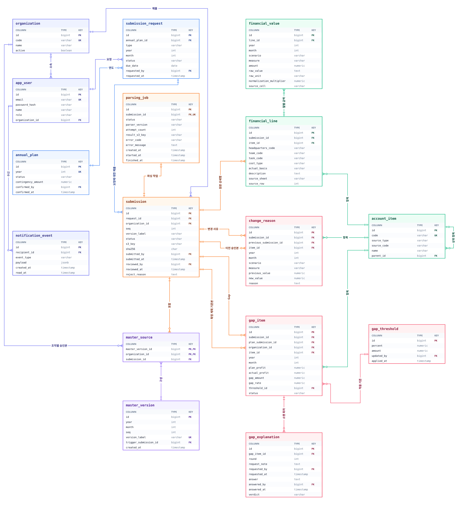
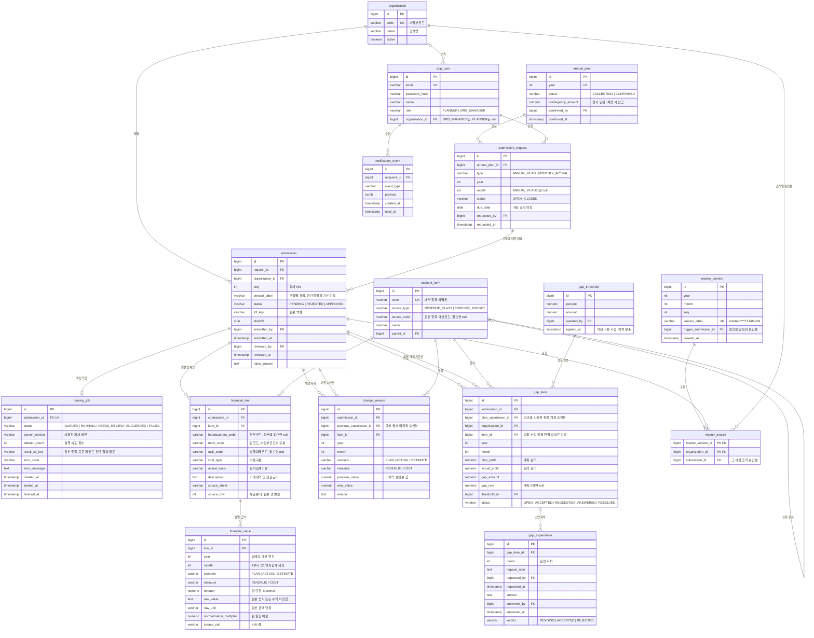

<!--

```mermaid
erDiagram
    organization |o--o{ app_user : "소속"
    organization ||--o{ submission : "제출"
    annual_plan ||--o{ submission_request : "연도"
    app_user ||--o{ submission_request : "요청"
    submission_request ||--o{ submission : "요청에 대한 제출"
    submission ||--o| parsing_job : "파싱 작업"
    submission ||--o{ financial_line : "원본 상세행"
    account_item ||--o{ financial_line : "항목"
    financial_line ||--o{ financial_value : "월별 금액"
    account_item |o--o{ account_item : "상위 항목"
    submission ||--o{ change_reason : "변경 사유"
    submission ||--o{ change_reason : "이전 승인본"
    account_item ||--o{ change_reason : "항목"
    submission ||--o{ gap_item : "Gap"
    submission ||--o{ gap_item : "확정 계획 기준본"
    account_item ||--o{ gap_item : "항목"
    gap_threshold ||--o{ gap_item : "적용 기준"
    gap_item ||--o{ gap_explanation : "소명 회차"
    master_version ||--|{ master_source : "구성"
    submission ||--o{ master_source : "포함"
    organization ||--o{ master_source : "조직별 승인본"
    app_user ||--o{ notification_event : "수신"

    organization {
        bigint id PK
        varchar code UK "사업부코드"
        varchar name "조직명"
        boolean active
    }

    app_user {
        bigint id PK
        varchar email UK
        varchar password_hash
        varchar name
        varchar role "PLANNER | ORG_MANAGER"
        bigint organization_id FK "ORG_MANAGER만, PLANNER는 null"
    }

    annual_plan {
        bigint id PK
        int year UK
        varchar status "COLLECTING | CONFIRMED"
        numeric contingency_amount "전사 단위, 확정 시 잠금"
        bigint confirmed_by FK
        timestamp confirmed_at
    }

    submission_request {
        bigint id PK
        bigint annual_plan_id FK
        varchar type "ANNUAL_PLAN | MONTHLY_ACTUAL"
        int year
        int month "ANNUAL_PLAN이면 null"
        varchar status "OPEN | CLOSED"
        date due_date "마감 규칙 미정"
        bigint requested_by FK
        timestamp requested_at
    }

    submission {
        bigint id PK
        bigint request_id FK
        bigint organization_id FK
        int seq "회차 NN"
        varchar version_label "조직별 유일, 연간계획 표기는 미정"
        varchar status "PENDING | REJECTED | APPROVED"
        varchar s3_key "원본 엑셀"
        char sha256
        bigint submitted_by FK
        timestamp submitted_at
        bigint reviewed_by FK
        timestamp reviewed_at
        text reject_reason
    }

    parsing_job {
        bigint id PK
        bigint submission_id FK,UK
        varchar status "QUEUED | RUNNING | NEEDS_REVIEW | SUCCEEDED | FAILED"
        varchar parser_version "사용한 파서 버전"
        int attempt_count "실행 시도 횟수"
        varchar result_s3_key "원본 추출·표준 레코드·진단 결과 참조"
        varchar error_code
        text error_message
        timestamp created_at
        timestamp started_at
        timestamp finished_at
    }

    account_item {
        bigint id PK
        varchar code UK "내부 항목 식별키"
        varchar source_type "REVENUE_CLASS | EXPENSE_BUDGET"
        varchar source_code "원본 항목·예산코드, 없으면 null"
        varchar name
        bigint parent_id FK
    }

    financial_line {
        bigint id PK
        bigint submission_id FK
        bigint item_id FK
        varchar headquarters_code "본부코드, 원본에 없으면 null"
        varchar team_code "팀코드, 사업부코드와 구분"
        varchar task_code "실행과제코드, 없으면 null"
        varchar cost_type "비용구분"
        varchar actual_basis "실적집계기준"
        text description "거래내역 및 산출근거"
        varchar source_sheet
        int source_row "제출본 내 원본 행 번호"
    }

    financial_value {
        bigint id PK
        bigint line_id FK
        int year "금액의 대상 연도"
        int month "1부터 12, 연간합계 제외"
        varchar scenario "PLAN | ACTUAL | ESTIMATE"
        varchar measure "REVENUE | COST"
        numeric amount "원 단위, Decimal"
        text raw_value "원본 숫자 또는 수식 저장값"
        varchar raw_unit "원본 금액 단위"
        numeric normalization_multiplier "원 환산 배율"
        varchar source_cell "시트!셀"
    }

    change_reason {
        bigint id PK
        bigint submission_id FK
        bigint previous_submission_id FK "대상 월의 마지막 승인본"
        bigint item_id FK
        int year
        int month
        varchar scenario "PLAN | ACTUAL | ESTIMATE"
        varchar measure "REVENUE | COST"
        numeric previous_value "마지막 승인본 값"
        numeric new_value
        text reason
    }

    gap_threshold {
        bigint id PK
        numeric percent
        numeric amount
        bigint updated_by FK
        timestamp applied_at "적용 버튼 시점, 이력 보존"
    }

    gap_item {
        bigint id PK
        bigint submission_id FK
        bigint plan_submission_id FK "비교에 사용한 확정 계획 승인본"
        bigint organization_id FK
        bigint item_id FK "공통 손익 항목 연결 방식은 미정"
        int year
        int month
        numeric plan_profit "계획 손익"
        numeric actual_profit "실적 손익"
        numeric gap_amount
        numeric gap_rate "계획 0이면 null"
        bigint threshold_id FK
        varchar status "OPEN | ACCEPTED | REQUESTED | ANSWERED | RESOLVED"
    }

    gap_explanation {
        bigint id PK
        bigint gap_item_id FK
        int round "요청 회차"
        text request_note
        bigint requested_by FK
        timestamp requested_at
        text answer
        bigint answered_by FK
        timestamp answered_at
        varchar verdict "PENDING | ACCEPTED | REJECTED"
    }

    master_version {
        bigint id PK
        int year
        int month
        int seq
        varchar version_label UK "master-YYYY-MM-NN"
        bigint trigger_submission_id FK "갱신을 일으킨 승인본"
        timestamp created_at
    }

    master_source {
        bigint master_version_id PK,FK
        bigint organization_id PK,FK
        bigint submission_id FK "그 시점 조직 승인본"
    }

    notification_event {
        bigint id PK
        bigint recipient_id FK
        varchar event_type
        jsonb payload
        timestamp created_at
        timestamp read_at
    }
```
-->
